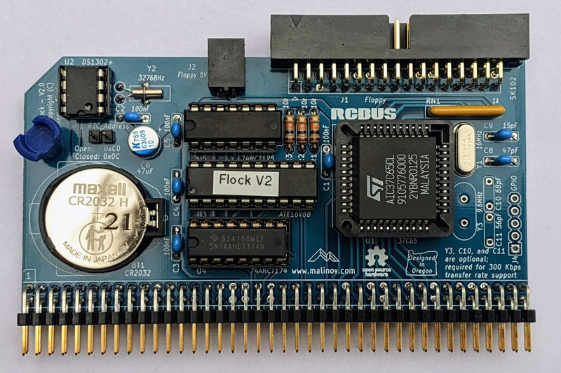

# Flock - Version 2.0
Floppy Disk Controller and Real Time Clock for RCBus systems

## Table of Content
* [Overview](#overview)
  * [Specifications](#specifications)
* [Assembly Instructions](#assembly-instructions)
* [Hardware Documentation](#hardware-documentation)
  * [Schematic and PCB Layout](#schematic-and-pcb-layout)
  * [Input/Output Ports](#inputoutput-ports)
  * [Connectors](#connectors)
  * [Bill of Materials](#bill-of-materials)
* [Release Notes](#release-notes)
  * [Changes](#changes)
  * [Known Issues](#known-issues)
* [Red Tape](#red-tape)
  * [Licensing](#licensing)
  * [Trademarks](#trademarks)

## Overview
Flock is an RCBus floppy disk controller (FDC) and real time clock (RTC) module. It designed to work with RomWBW firmware, supporting CP/M, ZSDOS, and various applications under these OSes.

### Specifications
* Floppy Disk Controller: Western Digital* WD37C65 or compatible
  * NEC uPD765 compatible with an integrated data separator, floppy interface drivers, and buffers
* Supported floppy disk formats:
  * 3.5", 720 KB
  * 3.5", 1.44 MB
  * 5.25", 360 KB diskettes in 360 MB drive
  * 5.25", 1.2 MB
  * 5.25", 360 KB diskettes in 1.2 MB drive (not supported by RomWBW, requires Y3, C10, and C11 to be installed)
* Supports two floppy drives, using IBM PC-like cable with twisted Disk Select / Motor Enable wires between two drives
* Real Time Clock: Maxim Integrated DS1302
* Bus: RCBus, RC2014* compatible

## Assembly Instructions

Please refer to [Assembly Instructions](Assembly_Instructions.md) document

## Hardware Documentation

### Schematic and PCB Layout

[Schematic - Version 2.0](KiCad/Z80-FDC-V2-Schematic-2.0.pdf)

[PCB Layout - Version 2.0](KiCad/Z80-FDC-V2-Board-2.0.pdf)

### Input/Output Ports

Flock uses the following I/O ports:

#### 0x48 - FDC CCR/DIR

Write: Floppy disk controller control configuration register (CCR)
Read: Floppy disk controller digital input register (DIR)

#### 0x50 - FDC MSR

Read: Floppy disk controller master status register (MSR)

#### 0x51 - FDC Data Register

Read/Write: Data from/to floppy disk controller

#### 0x58 - FDC DOR / TC

Write: Floppy disk controller digital output register (DOR)
Read: Toggle floppy disk controller transfer complete (TC) line

#### 0x0C or 0xC0 - RTC

Read/Write: Access real time clock (RTC)
The RTC address is configured using JP1 jumper

### Jumpers and Connectors

#### JP1 - RTC I/O address select

Position       | Description
-------------- | -----------------
open (default) | RTC address: 0xC0
closed         | RTC address: 0x0C

* Use 0xC0 address for Z80-based systems and 0x0C address for Z180-based systems

#### JP2 - Enable RTC

Position       | Description
-------------- | -----------------
1-2 (default)  | RTC enabled
2-3            | RTC disabled

* JP2 is a solder jumper, located on the back of the board
* By default positions 1-2 are connected with a PCB trace
* If the system already has an RTC or the RTC functionality is not needed:
  * Cut the PCB trace between positions 1-2
  * Connect positions 2-3 with a solder bridge

#### JP3 - Enable 300 Kbps transfer rate support

Position       | Description
-------------- | -----------------
1-2 (default)  | 300 Kbps disabled
2-3            | 300 Kbps enabled

* JP3 is a solder jumper, located on the back of the board
* By default positions 1-2 are connected with a PCB trace
* If 300 Kbps is desired:
  * Cut the PCB trace between positions 1-2
  * Connect positions 2-3 with a solder bridge
  * Install Y3, C10, and C11

#### J1 - Floppy
Connect to floppy drive interface connector.

Pin   | Signal Name | Description   | Pin   | Signal Name | Description
----- | ----------- | --------------| ----- | ----------- | -----------
J1-1  | GND         | Ground        | J1-2  | /DENSEL     | Density Select: 1 = Low density; 0 = High density
J1-3  | N/C         | Not connected | J1-4  | N/C         | Not connected
J1-5  | GND         | Ground        | J1-6  | N/C         | Not connected
J1-7  | GND         | Ground        | J1-8  | /INDEX      | Index hole: 0 = At the index hole
J1-9  | N/C         | Not connected | J1-10 | /MEA        | Motor Enable - Drive A
J1-11 | GND         | Ground        | J1-12 | /DSB        | Drive Select - Drive B
J1-13 | GND         | Ground        | J1-14 | /DSA        | Drive Select - Drive A
J1-15 | GND         | Ground        | J1-16 | /MEB        | Motor Enable - Drive B
J1-17 | N/C         | Not connected | J1-18 | /DIR        | Direction Select
J1-19 | GND         | Ground        | J1-20 | /STEP       | Head Step
J1-21 | GND         | Ground        | J1-22 | /WDATA      | Write Data
J1-23 | GND         | Ground        | J1-24 | /WE         | Write Enable: 0 = Write Enabled
J1-25 | GND         | Ground        | J1-26 | /TRK0       | Track 00: 0 = At the track 0
J1-27 | N/C         | Not connected | J1-28 | /WP         | Write Protect: 0 = Floppy disk is write protected
J1-29 | GND         | Ground        | J1-30 | /RDATA      | Read Data 
J1-31 | GND         | Ground        | J1-32 | /HDSEL      | Head Select / Side Select: 1 = Side 0; 0 = Side 1
J1-33 | N/C         | Not connected | J1-34 | /DC         | Disk changed: 1 = Disk changed; 0 = Ready

#### J2 - Floppy 5V
Connect to floppy 5V power supply connector.

**Important: J2 is an unfused 5V power supply for a single 3.5" floppy disk drive. Avoid overloading and short-circuiting**

Pin | Signal Name | Description
--- | ----------- | -----------
1   | 5V          | Positive terminal - +5V
2   | GND         | Negative terminal - ground

#### J3 - RCBus
Pin   | Signal Name | Description                             | Pin   | Signal Name | Description
----- | ----------- | --------------------------------------- | ----- | ----------- | -----------
J3-1  | A15         | Address A15; Input; Not connected       | J3-41 | p41         | Reserved; Not connected
J3-2  | A14         | Address A14; Input; Not connected       | J3-42 | /BAI        | Bus Acknowledge In; Not connected
J3-3  | A13         | Address A13; Input; Not connected       | J3-43 | /BAO        | Bus Acknowledge Out; Not connected
J3-4  | A12         | Address A12; Input; Not connected       | J3-44 | p44         | Reserved; Not connected
J3-5  | A11         | Address A11; Input; Not connected       | J3-45 | p45         | Reserved; Not connected
J3-6  | A10         | Address A10; Input; Not connected       | J3-46 | p46         | Reserved; Not connected
J3-7  | A9          | Address A9; Input; Not connected        | J3-47 | p47         | Reserved; Not connected
J3-8  | A8          | Address A8; Input; Not connected        | J3-48 | p48         | Reserved; Not connected
J3-9  | A7          | Address A7; Input                       | J3-49 | A23         | Address A23; Input; Not connected
J3-10 | A6          | Address A6; Input                       | J3-50 | A22         | Address A22; Input; Not connected
J3-11 | A5          | Address A5; Input                       | J3-51 | A21         | Address A21; Input; Not connected
J3-12 | A4          | Address A4; Input                       | J3-52 | A20         | Address A20; Input; Not connected
J3-13 | A3          | Address A3; Input                       | J3-53 | A19         | Address A19; Input; Not connected
J3-14 | A2          | Address A2; Input                       | J3-54 | A18         | Address A18; Input; Not connected
J3-15 | A1          | Address A1; Input                       | J3-55 | A17         | Address A17; Input; Not connected
J3-16 | A0          | Address A0; Input                       | J3-56 | A16         | Address A16; Input; Not connected
J3-17 | GND         | Ground                                  | J3-57 | GND         | Ground
J3-18 | VCC         | Power Supply - +5V                      | J3-58 | VCC         | Power Supply - +5V
J3-19 | /M1         | Machine Cycle One; Input                | J3-59 | /RFSH       | DRAM refresh; Input; Not connected
J3-20 | /RESET      | Reset; Input                            | J3-60 | PAGE        | Page ROM/RAM input; Not connected
J3-21 | CLK1        | CPU Clock; Input; Not connected         | J3-61 | CLK2        | UART Clock (programmable); Input; Not connected
J3-22 | /INT        | Interrupt; Output; Not connected        | J3-62 | /BUSACK     | DMA Bus Acknowledge; Input; Not connected
J3-23 | /MREQ       | Memory Request; Input; Not connected    | J3-63 | /HALT       | Halt; Input; Not connected
J3-24 | /WR         | Write Request; Input                    | J3-64 | /BUSREQ     | DMA Bus Request; Output; Not connected
J3-25 | /RD         | Read Request; Input                     | J3-65 | /WAIT       | Wait; Output; Not connected
J3-26 | /IORQ       | Input/Output Request; Input             | J3-66 | /NMI        | Non-maskable Interrupt; Output; Not connected
J3-27 | D0          | Data D0; Input/Output                   | J3-67 | D8          | Data D8; Input/Output; Not connected
J3-28 | D1          | Data D1; Input/Output                   | J3-68 | D9          | Data D9; Input/Output; Not connected
J3-29 | D2          | Data D2; Input/Output                   | J3-69 | D10         | Data D10; Input/Output; Not connected
J3-30 | D3          | Data D3; Input/Output                   | J3-70 | D11         | Data D11; Input/Output; Not connected
J3-31 | D4          | Data D4; Input/Output                   | J3-71 | D12         | Data D12; Input/Output; Not connected
J3-32 | D5          | Data D5; Input/Output                   | J3-72 | D13         | Data D13; Input/Output; Not connected
J3-33 | D6          | Data D6; Input/Output                   | J3-73 | D14         | Data D14; Input/Output; Not connected
J3-34 | D7          | Data D7; Input/Output                   | J3-74 | D15         | Data D15; Input/Output; Not connected
J3-35 | TX          | Channel 1, Transmit Data; Not Connected | J3-75 | TX2         | Channel 2, Transmit Data; Not Connected
J3-36 | RX          | Channel 1, Receive Data; Not Connected  | J3-76 | RX2         | Channel 2, Receive Data; Not Connected
J3-37 | /IRQ1       | Interrupt Request 1; Not connected      | J3-77 | /IRQ2       | Interrupt Request 2; Not connected
J3-38 | IEI         | Interrupt Enable In; Not connected      | J3-78 | p78         | Reserved; Not connected
J3-39 | IEO         | Interrupt Enable Out; Not connected     | J3-79 | p79         | Reserved; Not connected
J3-40 | USER4       | User Pin 4; Not connected               | J3-80 | USER8       | User Pin 8; Not connected

### Bill of Materials

#### Version 2.0

[Flock V2 project on Mouser.com](https://www.mouser.com/ProjectManager/ProjectDetail.aspx?AccessID=57797d9ea4) - View and order all components except of the FDC and the PCB.

[Flock project on OSH Park](https://oshpark.com/shared_projects/vQHiVNa8) - View and order the PCB.

Flock project on Tindie: [Complete kit](https://www.tindie.com/products/weird/flock-v2-rcbus-module-kit/); [Flock PCB and FDC](https://www.tindie.com/products/weird/flock-v2-rcbus-module-pcb-and-fdc/).

Component type     | Reference | Description                                 | Quantity | Possible sources and notes 
------------------ | --------- | ------------------------------------------- | -------- | --------------------------
PCB                |           | Flock PCB - Version 2.0                     | 1        | Buy from my Tindie store: [Complete kit](https://www.tindie.com/products/weird/flock-rcbus-v2-module-kit/); [Flock PCB and FDC](https://www.tindie.com/products/weird/flock-rcbus-v2-module-pcb-and-fdc/), or order from a PCB manufacturer of your choice using provided Gerber or KiCad files
Integrated Circuit | U1        | WD37C65BJM - FDC, CMOS, 44 pin PLCC         | 1        | eBay. Alternative: ST AIC37C65CL
Integrated Circuit | U2        | DS1302+ - RTC, 8 pin DIP                    | 1        | Mouser [700-DS1302](https://www.mouser.com/ProductDetail/700-DS1302)
Integrated Circuit | U3        | ATF16V8B-15PU - Simple Programmable Logic Device, 20 pin DIP | 1 | Mouser [556-AF16V8B15PU](https://www.mouser.com/ProductDetail/556-AF16V8B15PU)
Integrated Circuit | U4        | 74AHCT174 - Hex D-type flip-flop with reset, 16 pin DIP | 1 | Mouser [595-SN74AHCT174N](https://www.mouser.com/ProductDetail/595-SN74AHCT174N)
Integrated Circuit | U5        | 74HCT125 - Quadruple bus buffer gates with 3-state outputs, 14 pin DIP | 1 | Mouser [595-SN74HCT125NE4](https://www.mouser.com/ProductDetail/595-SN74HCT125NE4)
Quartz Crystal     | Y1        | 16 MHz, series                              | 1        | Mouser [774-ATS160-E](https://www.mouser.com/ProductDetail/774-ATS160-E)
Quartz Crystal     | Y2        | 32768 Hz, 6 pF                              | 1        | Mouser [815-AB26T32768KHZ6B](https://www.mouser.com/ProductDetail/815-AB26T32768KHZ6B)
Quartz Crystal     | Y3        | 9.6 MHz, series                             | 1        | Optional; Install for 300 Kbps transfer rate support
Connector          | J1        | 2x17 pin header, shrouded, 2.54 mm pitch, right angle | 1 | Mouser [517-30334-5002](https://www.mouser.com/ProductDetail/517-30334-5002)
Connector          | J2        | 2 pin header with friction lock, right angle | 1       | Mouser [571-2-644488-2](https://www.mouser.com/ProductDetail/571-2-644488-2)
Pin Header         | J3        | 2x40 pin header, 2.54 mm pitch, right angle | 1        | Mouser [517-5121TG](https://www.mouser.com/ProductDetail/517-5121TG)
Pin Header         | JP1       | 2 pin header, 2.54 mm pitch                 | 1        | Mouser [649-68002-102HLF](https://www.mouser.com/ProductDetail/649-68002-102HLF)
Jumper             | JP1       | Shunt, 2 pin 2.54 mm pitch                  | 1        | Mouser [806-SX1100-B](https://www.mouser.com/ProductDetail/806-SX1100-B)
Battery Holder     | BT1       | CR2032 battery holder                       | 1        | Mouser [122-2620-GR](https://www.mouser.com/ProductDetail/122-2620-GR) or [122-2420-GR](https://www.mouser.com/ProductDetail/122-2420-GR). Install either BT1 or C7
Battery            | BT1       | CR2023 battery                              | 1        | Mouser [81-CR2032](https://www.mouser.com/ProductDetail/81-CR2032), [658-CR2032](https://www.mouser.com/ProductDetail/658-CR2032), or [614-CR2032-200](https://www.mouser.com/ProductDetail/614-CR2032-200). Install either BT1 or C7
Capacitor          | C1 - C5   | 0.1 uF, 50V, MLCC, 5 mm pitch               | 5        | Mouser [810-FG28X7R1H104KNT6](https://www.mouser.com/ProductDetail/810-FG28X7R1H104KNT6)
Capacitor          | C6        | 10 uF, 47V, Organic Polymer, 6.3 mm diameter, 2.5 mm pitch | 1 | Mouser [80-A759EA106M1JAAE60](https://www.mouser.com/ProductDetail/80-A759EA106M1JAAE60). Note: PCB silkscreen specifies 47uF capacitor. 10uF - 47uF capacitor with voltage rating 10V or more can be used
Capacitor          | C7        | 0.22 F, 5.5V, Supercapacitor, 13.5 mm diameter, 5 mm pitch | 1 | Mouser [555-DBN-5R5D334T](https://www.mouser.com/ProductDetail/555-DBN-5R5D334T). Install either BT1 or C7
Capacitor          | C8        | 47 pF, 50V, MLCC, 5 mm pitch                | 1        | Mouser [810-FG28C0G2A470JNT0](https://www.mouser.com/ProductDetail/810-FG28C0G2A470JNT0)
Capacitor          | C9        | 15 pF, 50V, MLCC, 5 mm pitch                | 1        | Mouser [810-FG28C0G2A150JNT0](https://www.mouser.com/ProductDetail/810-FG28C0G2A150JNT0)
Capacitor          | C10       | 68 pF, 50V, MLCC, 5 mm pitch                | 1        | Optional; Install for 300 Kbps transfer rate support
Capacitor          | C11       | 56 pF, 50V, MLCC, 5 mm pitch                | 1        | Optional; Install for 300 Kbps transfer rate support
Resistor Array     | RN1       | 1 kohm, bussed, 6 pin SIP                   | 1        | Mouser [652-4606X-1LF-1K](https://www.mouser.com/ProductDetail/652-4606X-1LF-1K)
Resistor           | R1 - R3   | 10 kohm, 0.25 W, 1% tolerance, axial        | 3        | Mouser [603-MFR-25FRF5210K](https://www.mouser.com/ProductDetail/603-MFR-25FRF5210K)
IC Socket          | U1        | 44 pin PLCC, through hole                   | 1        | Mouser [649-54020-44030LF](https://www.mouser.com/ProductDetail/649-54020-44030LF), [517-8444-11B1-RK-TP](https://www.mouser.com/ProductDetail/517-8444-11B1-RK-TP)
IC Socket          | U2        | 8 pin DIP                                   | 1        | Mouser [649-DILB8P223TLF](https://www.mouser.com/ProductDetail/649-DILB8P223TLF)
IC Socket          | U3        | 20 pin DIP                                  | 1        | Mouser [649-DILB20P-223TLF](https://www.mouser.com/ProductDetail/649-DILB20P-223TLF)
IC Socket          | U4        | 16 pin DIP                                  | 1        | Mouser [649-DILB16P-223TLF](https://www.mouser.com/ProductDetail/649-DILB16P-223TLF)
IC Socket          | U5        | 14 pin DIP                                  | 1        | Mouser [649-DILB14P-223TLF](https://www.mouser.com/ProductDetail/649-DILB14P-223TLF)
Connector          | J2        | 2 pin connector                             | 1        | Mouser [571-3-643813-2](https://www.mouser.com/ProductDetail/571-3-643813-2)
Connector          | J2        | Floppy disk power connector housing         | 1        | Mouser [571-1718224](https://www.mouser.com/ProductDetail/571-1718224)
Connector          | J2        | Floppy disk power connector contacts        | 2        | Mouser [571-170262-2-LP](https://www.mouser.com/ProductDetail/571-170262-2-LP), [571-1702622-CT](https://www.mouser.com/ProductDetail/571-1702622-CT) (strip of 100 contacts)

## Release Notes

### Changes

* Version 2.0
  * Update form factor from RC2014* compatible to RCBus
  * Add an option to use CR2032 battery instead of a super capacitor for the RTC
  * Use right angle connector for the floppy interface
  * Use ATF16V8B SPLD for address decode
  * Add JP1 jumper for selecting RTC I/O address. Either 0xC0 or 0x0C can be used
  * Add JP2 jumper for disabling the RTC.
  * Add an option to support 300 Kbps transfer speed
  * Add a header for GPIO signals
* Version 1.0
  * Initial version

### Known Issues

* Version 1.0
  * No known issues

### Wishlist
* None so far

## Red Tape

### Licensing

Flock is an open source hardware project certified by [Open Source Hardware Association](https://www.oshwa.org/), certification UID is [US002115](https://certification.oshwa.org/us002115.html). The hardware design itself, including schematic and PCB layout design files are licensed under the strongly-reciprocal variant of [CERN Open Hardware Licence version 2](license-cern_ohl_s_v2.txt). The CPLD VHDL code is licensed under [GNU General Public License v3](license-gpl-3.0.txt). Documentation, including this file, is licensed under the [Creative Commons Attribution-ShareAlike 4.0 International License](license-cc-by-sa-4.0.txt).

### Trademarks

* "RC2014" is a registered trademark of RFC2795 Ltd.
* Other names and brands may be claimed as the property of others.
